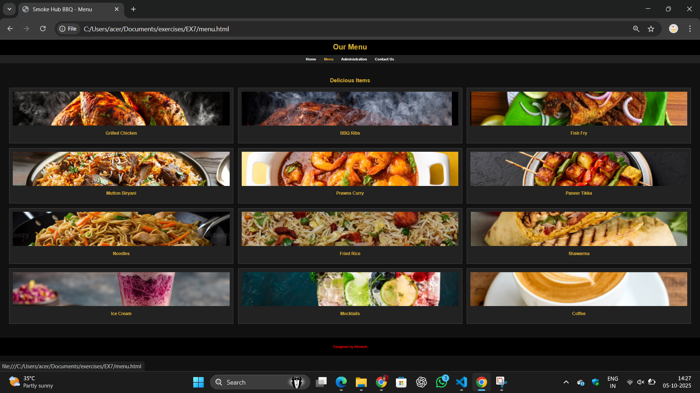

# Ex.07 Restaurant Website
# Date:05-10-2025
# AIM:
To develop a static Restaurant website to display the food items and services provided by them.

# DESIGN STEPS:
## Step 1:
Requirement collection.

## Step 2:
Creating the layout using HTML and CSS.

## Step 3:
Updating the sample content.

## Step 4:
Choose the appropriate style and color scheme.

## Step 5:
Validate the layout in various browsers.

## Step 6:
Validate the HTML code.

## Step 7:
Publish the website in the given URL.

# PROGRAM:
admin.html
```
<!DOCTYPE html>
<html>
<head>
  <title>Smoke Hub BBQ - Administration</title>
  <style>
    body { margin:0; font-family: Arial; background:#111; color:#fff; }
    header { background:#000; padding:15px; text-align:center; }
    header h1 { color:#d4af37; margin:0; }
    nav { background:#222; text-align:center; padding:10px; }
    nav a { color:#fff; margin:0 15px; text-decoration:none; font-weight:bold; }
    nav a:hover { color:#d4af37; }
    section { padding:40px; text-align:center; }
    section h2 { color:#d4af37; margin-bottom:20px; }
    .team { display:grid; grid-template-columns: repeat(3,1fr); gap:20px; }
    .member { background:#222; padding:15px; border:1px solid #444; }
    .member img { width:120px; height:120px; border-radius:50%; }
    .member h3 { color:#d4af37; margin:10px 0 5px; }
    footer { background:#000; color:#fff; text-align:center; padding:15px; margin-top:20px; }
  </style>
</head>
<body>

<header><h1>Administration</h1></header>

<nav>
  <a href="index.html">Home</a>
  <a href="menu.html">Menu</a>
  <a href="admin.html">Administration</a>
  <a href="contact.html">Contact Us</a>
</nav>

<section>
  <h2>Meet Our Team</h2>
  <div class="team">
    <div class="member"><h3>Abinesh</h3><p>Manager</p></div>
    <div class="member"><h3>Sara</h3><p>Head Chef</p></div>
    <div class="member"><h3>Mike</h3><p>Waiter</p></div>
    <div class="member"><h3>Anita</h3><p>Cashier</p></div>
    <div class="member"><h3>Vikram</h3><p>Cleaner</p></div>
    <div class="member"><h3>Ravi</h3><p>Delivery</p></div>
  </div>
</section>

<footer><p>Designed by Abinesh</p></footer>
</body>
</html>

```
contact.html
```
<!DOCTYPE html>
<html>
<head>
  <title>Smoke Hub BBQ - Contact Us</title>
  <style>
    body { margin:0; font-family: Arial; background:#111; color:#fff; }
    header { background:#000; padding:15px; text-align:center; }
    header h1 { color:#d4af37; margin:0; }
    nav { background:#222; text-align:center; padding:10px; }
    nav a { color:#fff; margin:0 15px; text-decoration:none; font-weight:bold; }
    nav a:hover { color:#d4af37; }
    section { padding:40px; text-align:center; }
    section h2 { color:#d4af37; margin-bottom:20px; }
    footer { background:#000; color:#fff; text-align:center; padding:15px; margin-top:20px; }
  </style>
</head>
<body>

<header><h1>Contact Us</h1></header>

<nav>
  <a href="index.html">Home</a>
  <a href="menu.html">Menu</a>
  <a href="admin.html">Administration</a>
  <a href="contact.html">Contact Us</a>
</nav>

<section>
  <h2>Get in Touch</h2>
  <p>📍 Address: 123 BBQ Street, Chennai</p>
  <p>📞 Phone: +91 98765 43210</p>
  <p>📧 Email: smokehub@example.com</p>
</section>

<footer><p>Designed by Abinesh</p></footer>
</body>
</html>

```
index.html
```
<!DOCTYPE html>
<html>
<head>
  <title>Smoke Hub BBQ - Home</title>
  <style>
    body { margin:0; font-family: Arial, sans-serif; background:#111; color:#fff; }
    header { background:#000; padding:15px; text-align:center; }
    header h1 { color:#d4af37; margin:0; }
    nav { background:#222; text-align:center; padding:10px; }
    nav a { color:#fff; margin:0 15px; text-decoration:none; font-weight:bold; }
    nav a:hover { color:#d4af37; }
    .banner img { width:100%; height:300px; object-fit:cover; }
    section { padding:40px; text-align:center; }
    section h2 { color:#d4af37; }
    footer { background:#000; color:#fff; text-align:center; padding:15px; margin-top:20px; }
   
  </style>
</head>
<body>

<header>
  <h1>SMOKE HUB BBQ</h1>
</header>

<nav>
  <a href="index.html">Home</a>
  <a href="menu.html">Menu</a>
  <a href="admin.html">Administration</a>
  <a href="contact.html">Contact Us</a>
</nav>

<div class="banner">
  
</div>

<section>
  <h2>Welcome to Smoke Hub</h2>
  <p>The taste of authentic barbeque served with luxury ambience.</p>
</section>

<footer>
  <p>Designed by Abinesh</p>
</footer>

</body>
</html>

```
menu.html
```
<!DOCTYPE html>
<html>
<head>
  <title>Smoke Hub BBQ - Menu</title>
  <style>
    body { margin:0; font-family: Arial, sans-serif; background:#111; color:#fff; }
    header { background:#000; padding:15px; text-align:center; }
    header h1 { color:#d4af37; margin:0; }
    nav { background:#222; text-align:center; padding:10px; }
    nav a { color:#fff; margin:0 15px; text-decoration:none; font-weight:bold; }
    nav a:hover { color:#d4af37; }
    section { padding:40px; text-align:center; }
    section h2 { color:#d4af37; margin-bottom:20px; }
    .menu-grid { display:grid; grid-template-columns: repeat(3,1fr); gap:20px; }
    .item { background:#222; padding:15px; border:1px solid #444; }
    .item img { width:100%; height:150px; object-fit:cover; }
    .item h3 { color:#d4af37; }
    footer { background:#000; color:#fff; text-align:center; padding:15px; margin-top:20px; }
  </style>
</head>
<body>

<header><h1>Our Menu</h1></header>

<nav>
  <a href="index.html">Home</a>
  <a href="menu.html">Menu</a>
  <a href="admin.html">Administration</a>
  <a href="contact.html">Contact Us</a>
</nav>

<section>
  <h2>Delicious Items</h2>
  <div class="menu-grid">
    <div class="item"><h3>Grilled Chicken</h3></div>
    <div class="item"><h3>BBQ Ribs</h3></div>
    <div class="item"><h3>Fish Fry</h3></div>
    <div class="item"><h3>Mutton Biryani</h3></div>
    <div class="item"><h3>Prawns Curry</h3></div>
    <div class="item"><h3>Paneer Tikka</h3></div>
    <div class="item"><h3>Noodles</h3></div>
    <div class="item"><h3>Fried Rice</h3></div>
    <div class="item"><h3>Shawarma</h3></div>
    <div class="item"><h3>Ice Cream</h3></div>
    <div class="item"><h3>Mocktails</h3></div>
    <div class="item"><h3>Coffee</h3></div>
  </div>
</section>

<footer><p style="color:red;">Designed by Abinesh</p></footer>
</body>
</html>

```
# OUTPUT:




# RESULT:
The program for designing software company website using HTML and CSS is completed successfully.
